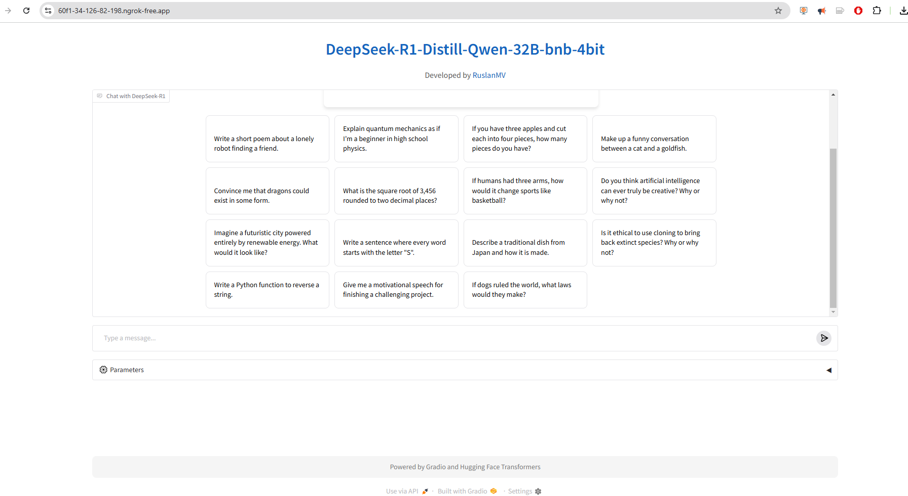
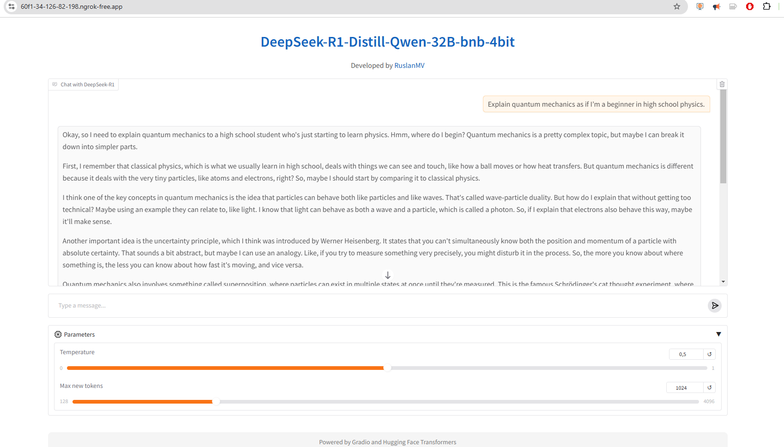

# DeepSeek-R1: A New Era in Reinforcement Learning-Driven Language Models

## Introduction

DeepSeek-R1 is a groundbreaking advancement in large language models (LLMs), challenging traditional methods that rely heavily on supervised fine-tuning (SFT). Instead, it leverages **Reinforcement Learning (RL)** to achieve advanced reasoning capabilities without extensive human-annotated data. This blog explores how DeepSeek-R1 is reshaping AI research, its technical innovations, and its potential applications.

---

## 1. Pure Reinforcement Learning for Advanced Reasoning

### 1.1 No Supervised Fine-Tuning (SFT) Needed

Most LLMs start with **supervised fine-tuning (SFT)**, where they learn from human-annotated data. **DeepSeek-R1-Zero**, however, skips this step entirely, relying solely on **Reinforcement Learning (RL)** to develop robust reasoning abilities.

#### 1.1.1 RL as the Core Driver

In RL, each token generated by the model is treated as an action, guided by a policy that maximizes rewards. This approach allows DeepSeek-R1-Zero to achieve advanced reasoning without any supervised examples.

### 1.2 Emergence of Self-Verification and Reflection

During training, DeepSeek-R1-Zero exhibited **self-verification** and **reflection** behaviors:
- **Self-Verification:** The model revisits and corrects its own outputs.
- **Reflection:** It generates **chain-of-thought** explanations, refining its logic step-by-step.

This is the first open research confirming that **large-scale RL alone** can foster deep reasoning, reducing the need for expensive human-annotated data.

---

## 2. Overcoming Challenges with DeepSeek-R1

### 2.1 Limitations of Pure RL

While DeepSeek-R1-Zero demonstrated strong reasoning, it had some quirks:
- **Repetition** of phrases.
- **Mixed-language outputs**.
- **Poor readability** in some cases.

These issues highlighted the need for a small amount of supervised data to stabilize the model.

### 2.2 Introducing a Supervised Kickstart

**DeepSeek-R1** introduced a **small supervised phase** before RL training. This "kickstart" phase primed the model with cleaner language generation habits, significantly improving its stability and performance.

### 2.3 Performance on Par with Top Models

After the supervised kickstart and further RL fine-tuning, DeepSeek-R1 matched the performance of top-tier models like **OpenAI-o1** in tasks such as:
- **Mathematics** (complex proofs, arithmetic).
- **Coding** (code generation, debugging).
- **Multistep Reasoning** (long chain-of-thought dialogues).

This hybrid approach shows that even a **small amount of supervised data** can dramatically improve model performance.

---

## 3. Massive Scale and Open-Source Commitment

### 3.1 600B Parameters and 128K Token Context

DeepSeek-R1 is built on **DeepSeek-V3-Base**, with **671B parameters** (though only ~37B are active during inference). It supports a **128K token context**, enabling it to handle long-form content like legal documents or multi-turn conversations.

### 3.2 Fully Open-Sourced

The entire **DeepSeek-R1** family, including **DeepSeek-R1-Zero** and distilled versions, is **open-source**. The team released:
- Model weights.
- Training scripts.
- Detailed documentation.

This openness allows developers and researchers to experiment, fine-tune, and innovate without restrictions.

---

## 4. A Multi-Stage Training Pipeline

### 4.1 Two RL Stages + Two SFT Stages

DeepSeek-R1’s training pipeline consists of four stages:
1. **RL Stage 1:** Pure RL training (DeepSeek-R1-Zero style).
2. **SFT Stage 1:** Small supervised kickstart.
3. **RL Stage 2:** Further RL fine-tuning with refined rewards.
4. **SFT Stage 2:** Alignment with human preferences.

This multi-stage approach ensures the model discovers superior reasoning patterns and aligns them with human-centric qualities like clarity and accuracy.

### 4.2 Alignment with Human Preferences

During alignment, the model is guided by **human evaluators** or proxy reward models to ensure outputs are:
- **Clear** and well-structured.
- **Accurate** in logic and facts.
- **Respectful** of content guidelines.

---

## 5. Distillation: Smaller Models with Big Potential

### 5.1 Knowledge Distillation

DeepSeek-R1 uses **distillation** to transfer knowledge from its large model to smaller variants (e.g., 1.5B, 7B, 32B). These distilled models retain the reasoning abilities of the larger model while being more efficient.

### 5.2 Outperforming Larger Models

Some distilled versions, like **DeepSeek-R1-Distill-Qwen-32B**, outperform significantly larger models on benchmarks, proving that **intelligent compression** can deliver powerful results.

---

## 6. Record-Setting Benchmarks

### 6.1 State-of-the-Art Performance

DeepSeek-R1’s distilled models lead in key benchmarks, including:
- **Mathematics** (MATH, GSM8K).
- **Coding** (code generation, debugging).
- **General Reasoning** (multi-step problem-solving).

This challenges the assumption that only ultra-large models (200B+ parameters) can achieve top performance.

---

## 7. Open Tools and Community Collaboration

### 7.1 Open-Source Ecosystem

The DeepSeek team provides:
- **Example configurations** for fine-tuning.
- **Tokenizers** for specialized tasks.
- **Content policy guidelines** for responsible usage.

### 7.2 Encouraging Collaboration

They invite the community to:
- Fine-tune models for domain-specific tasks.
- Conduct benchmark evaluations.
- Propose new alignment strategies.

This open approach accelerates AI research and innovation.

---

## 8. Long-Form Reasoning with 128K Token Context

### 8.1 Extended Context Windows

DeepSeek-R1’s **128K token context** enables it to handle long-form content, such as:
- **Legal documents**.
- **Scientific papers**.
- **Multi-turn conversations**.

### 8.2 Real-World Applications

This capability is crucial for tasks like:
- **Multi-document summarization**.
- **Extended code debugging**.
- **Detailed policy compliance checks**.

---

## 9. Future Directions

### 9.1 Expanding to New Domains

DeepSeek-R1’s RL-driven approach can be applied to:
- **Scientific research**.
- **Legal text analysis**.
- **Technical documentation**.

### 9.2 Improving Distillation Techniques

Future work may focus on refining distillation methods to further enhance smaller models.

### 9.3 Ethical Considerations

As LLMs grow more powerful, addressing **bias**, **misuse prevention**, and **user education** will be critical.


## Simple Python Code for a DeepSeek-R1-Inspired Chatbot

Building an interactive AI-powered chatbot is easier than you think, thanks to frameworks like **Hugging Face Transformers** and **Gradio**. Below is a Python implementation inspired by **DeepSeek-R1**, demonstrating how to load a **state-of-the-art distilled model** and deploy it as a chatbot interface. 

This walkthrough focuses on key components like model loading, custom chat templates, streaming responses, and creating an intuitive user interface using Gradio. For illustration purposes, we use the model `DeepSeek-R1-Distill-Qwen-32B-bnb-4bit` as an example of a cutting-edge, distilled language model.

Here's a breakdown of the process and how the code is structured to achieve the desired functionality.

--- 

This example will guide you through:  
- **Setting up the environment** with proper imports and configurations.  
- **Loading the model and tokenizer**, ensuring it’s optimized for conversation-based tasks.  
- **Creating a streaming chat function** that processes user input and generates responses dynamically.  
- **Building a Gradio-powered user interface** to enable interaction in a clean, user-friendly web app.  

Let’s dive in!


```python
import gradio as gr
import os
import spaces
from transformers import GemmaTokenizer, AutoModelForCausalLM
from transformers import AutoModelForCausalLM, AutoTokenizer, TextIteratorStreamer
from threading import Thread

# Set an environment variable
HF_TOKEN = os.environ.get("HF_TOKEN", None)

# Custom HTML for the header and footer
DESCRIPTION = '''
<div style="text-align: center;">
    <h1 style="font-size: 32px; font-weight: bold; color: #1565c0;">DeepSeek-R1-Distill-Qwen-32B-bnb-4bit</h1>
    <p style="font-size: 16px; color: #555;">Developed by <a href="https://ruslanmv.com/" target="_blank" style="color: #1565c0; text-decoration: none;">RuslanMV</a></p>
</div>
'''

FOOTER = '''
<div style="text-align: center; margin-top: 20px; padding: 10px; background-color: #f5f5f5; border-radius: 8px;">
    <p style="font-size: 14px; color: #777;">Powered by Gradio and Hugging Face Transformers</p>
</div>
'''

PLACEHOLDER = '''
<div style="padding: 30px; text-align: center; display: flex; flex-direction: column; align-items: center;">
    <h1 style="font-size: 28px; margin-bottom: 2px; opacity: 0.55;">DeepSeek-R1-Distill-Qwen-32B-bnb-4bit</h1>
    <p style="font-size: 18px; margin-bottom: 2px; opacity: 0.65;">Ask me anything...</p>
</div>
'''

# Custom CSS for better styling
css = """
h1 {
    text-align: center;
    display: block;
    font-weight: bold;
    color: #1565c0;
}
#duplicate-button {
    margin: auto;
    color: white;
    background: #1565c0;
    border-radius: 100vh;
}
.chatbot {
    border-radius: 8px;
    box-shadow: 0 4px 6px rgba(0, 0, 0, 0.1);
}
.accordion {
    background-color: #f5f5f5;
    border-radius: 8px;
    padding: 10px;
}
"""

# Load the tokenizer and model
tokenizer = AutoTokenizer.from_pretrained("unsloth/DeepSeek-R1-Distill-Qwen-32B-bnb-4bit")
tokenizer.chat_template = "{{bos_token}}{{ns.system_prompt}}{{'<|user|>' + message['content']}}{{'<|assistant|>' + tool['type'] + ':' + tool['function']['name'] + '\\n' + '```json' + '\\n' + tool['function']['arguments'] + '\\n' + '```' + '}}\\n'}}{{'\\n' + '<|assistant|>' + tool['type'] + ':' + tool['function']['name'] + '\\n' + '```json' + '\\n' + tool['function']['arguments'] + '\\n' + '```' + '}}\\n'}}{{'}}\\n'}}{{'<|assistant|>' + message['content'] + '}}\\n'}}{{'<|assistant|>' + content + '}}\\n'}}{{'<|tool|>' + message['content'] + '}}\\n'}}{{'\\n<|tool|>' + message['content'] + '}}\\n'}}{{'<|assistant|>'}}{{'<|assistant|>'}}"

model = AutoModelForCausalLM.from_pretrained("unsloth/DeepSeek-R1-Distill-Qwen-32B-bnb-4bit", device_map="auto")
terminators = [
    tokenizer.eos_token_id,
]

@spaces.GPU(duration=120)
def chat_llama3_8b(message: str, history: list, temperature: float, max_new_tokens: int) -> str:
    """
    Generate a streaming response using the llama3-8b model.
    Args:
        message (str): The input message.
        history (list): The conversation history used by ChatInterface.
        temperature (float): The temperature for generating the response.
        max_new_tokens (int): The maximum number of new tokens to generate.
    Returns:
        str: The generated response.
    """
    conversation = []
    for user, assistant in history:
        conversation.extend([{"role": "user", "content": user}, {"role": "assistant", "content": assistant}])
    conversation.append({"role": "user", "content": message})

    input_ids = tokenizer.apply_chat_template(conversation, return_tensors="pt", add_generation_prompt=True).to(model.device)
    streamer = TextIteratorStreamer(tokenizer, timeout=10.0, skip_prompt=True, skip_special_tokens=True)

    generate_kwargs = dict(
        input_ids=input_ids,
        streamer=streamer,
        max_new_tokens=max_new_tokens,
        do_sample=True,
        temperature=temperature,
        eos_token_id=terminators,
    )
    if temperature == 0:
        generate_kwargs['do_sample'] = False

    t = Thread(target=model.generate, kwargs=generate_kwargs)
    t.start()

    outputs = []
    for text in streamer:
        if "<think>" in text:
            text = text.replace("<think>", "[think]").strip()
        if "</think>" in text:
            text = text.replace("</think>", "[/think]").strip()
        outputs.append(text)
        yield "".join(outputs)

# Gradio block
chatbot = gr.Chatbot(height=450, placeholder=PLACEHOLDER, label='Chat with DeepSeek-R1')

with gr.Blocks(fill_height=True, css=css) as demo:
    gr.Markdown(DESCRIPTION)
    gr.ChatInterface(
        fn=chat_llama3_8b,
        chatbot=chatbot,
        fill_height=True,
        additional_inputs_accordion=gr.Accordion(label="⚙️ Parameters", open=False, render=False),
        additional_inputs=[
            gr.Slider(minimum=0, maximum=1, step=0.1, value=0.5, label="Temperature", render=False),
            gr.Slider(minimum=128, maximum=4096, step=1, value=1024, label="Max new tokens", render=False),
        ],

        
        examples=[
            ['Write a short poem about a lonely robot finding a friend.'],
            ['Explain quantum mechanics as if I’m a beginner in high school physics.'],
            ['If you have three apples and cut each into four pieces, how many pieces do you have?'],
            ['Make up a funny conversation between a cat and a goldfish.'],
            ['Convince me that dragons could exist in some form.'],
            ['What is the square root of 3,456 rounded to two decimal places?'],
            ['If humans had three arms, how would it change sports like basketball?'],
            ['Do you think artificial intelligence can ever truly be creative? Why or why not?'],
            ['Imagine a futuristic city powered entirely by renewable energy. What would it look like?'],
            ['Write a sentence where every word starts with the letter "S".'],
            ['Describe a traditional dish from Japan and how it is made.'],
            ['Is it ethical to use cloning to bring back extinct species? Why or why not?'],
            ['Write a Python function to reverse a string.'],
            ['Give me a motivational speech for finishing a challenging project.'],
            ['If dogs ruled the world, what laws would they make?']
        ]
        
        
        ,
        cache_examples=False,
    )
    gr.Markdown(FOOTER)

if __name__ == "__main__":
    demo.launch()
    
```


You can have something like this



You can execute the previos code on google colab with the A100 GPU [here](https://colab.research.google.com/github/ruslanmv/DeepSeek-R1-RL-Driven-Language-Models/blob/master/app.ipynb)


### Key Takeaways

This code showcases how to integrate a large language model into an interactive application. The combination of Hugging Face Transformers and Gradio provides a flexible framework for building and customizing AI-powered chatbots. You can further extend this setup by:
- **Fine-tuning the model** with domain-specific data.
- **Adding more UI features**, such as file uploads or speech-to-text capabilities.
- **Deploying the app** on platforms like Hugging Face Spaces for broader accessibility.

This project is a great starting point for experimenting with LLMs and creating interactive, AI-driven tools. Welcome to the exciting world of conversational AI!


